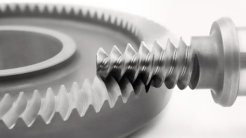

# TRIBOSOFT_-TRIBOSOFT_HIPOID_WORM_SLIDING

TRIBO_SOFT

Apresentação do trabalho

Este trabalho apresenta o desenvolvimento de um modelo matemático e computacional para análise tribológica de contatos lubrificados, construído progressivamente a partir da caracterização geométrica e cinemática do contato, da determinação das solicitações mecânicas e térmicas e da avaliação dos principais mecanismos de degradação associados à superfície de contato.
O desenvolvimento é organizado em uma sequência de formulações que parte da definição do sistema físico e evolui para a representação matemática do volume tribológico, estabelecendo as relações entre geometria, movimento relativo, carregamento, pressão de contato, deformação, lubrificação e transferência de energia.
A partir dessa estrutura são incorporados os modelos necessários para caracterizar o comportamento do contato sob diferentes condições de operação, incluindo:
contato Hertziano;
tensões de contato e subsuperficiais;
lubrificação elastohidrodinâmica (EHL);
espessura mínima da película;
razão de filme �;
atrito;
geração de calor;
temperatura de contato e temperatura de flash;
desgaste;
micropitting;
macropitting e fadiga de contato;
scuffing;
critérios de integridade;
interação entre os diferentes mecanismos de degradação.
As formulações são posteriormente organizadas em um sistema computacional capaz de receber os parâmetros físicos do contato, executar os cálculos correspondentes e apresentar os resultados de forma integrada.
O objetivo não é reduzir o comportamento tribológico a um único critério de falha. O modelo procura representar o contato como um sistema acoplado, no qual alterações de carga, geometria, velocidade, propriedades dos materiais, lubrificação, temperatura e condições superficiais podem modificar simultaneamente diferentes grandezas de interesse.
O desenvolvimento matemático culmina na implementação computacional modelo_tribologico_v7.81.py, que consolida as formulações utilizadas no trabalho em uma ferramenta única de cálculo.
O V7.81.py representa a etapa computacional final do desenvolvimento apresentado: as formulações matemáticas desenvolvidas ao longo das seções do trabalho são transformadas em um procedimento operacional capaz de calcular e organizar os parâmetros tribológicos do contato estudado.
O software constitui, portanto, a implementação computacional do modelo desenvolvido, enquanto as seções matemáticas anteriores estabelecem a fundamentação, as relações de cálculo, os critérios e os limites utilizados por essa implementação.

E1 — Estrutura geral
E2 — Definição matemática do contato cinemático
E3 — Formação do volume tribológico de contato
E4 — Solicitações no volume tribológico
E5 — Resistência e integridade do volume tribológico
6 — Construção do modelo tribológico acoplado
7 — Mecanismos de limite e domínios de admissibilidade
8 — Entrada da carga
9 — Campo de pressão e microtopologia
10 — Caracterização geométrica do contato
11 — Quantificação térmica
12 — Resistência ao micropitting
13 — Quantificação da resistência à fadiga de contato e ao macropitting
14 — Quantificação do desgaste
15 — Integração dos critérios de limite e domínio global de integridade tribológica
16 — Lubrificação e regime EHL
17 — Espessura mínima da película lubrificante
18 — Razão de filme �
19 — Atrito e geração de calor
20 — Temperatura de flash e temperatura de contato
21 — Scuffing e estabilidade térmica
22 — Interação dos mecanismos de falha
23 — Discretização espacial do volume tribológico
24 — Discretização temporal e por ciclos
25 — Solução numérica dos campos acoplados
26 — Tratamento das condições de contorno
27 — Calibração e identificação dos parâmetros do modelo
28 — Verificação matemática e validação física
29 — Análise de sensibilidade e propagação de incertezas
30 — Análise paramétrica e construção dos mapas de integridade
31 — Critérios de convergência e estabilidade numérica
32 — Estrutura computacional final do modelo
Seções 33–39
33 — Fluxograma completo de cálculo
34 — Formulação matemática consolidada
35 — Critérios de interpretação dos resultados
36 — Limitações, hipóteses e domínio de validade
37 — Modelo final integrado de integridade tribológica
38 — Resultados e análise do modelo
39 — Conclusões matemáticas

